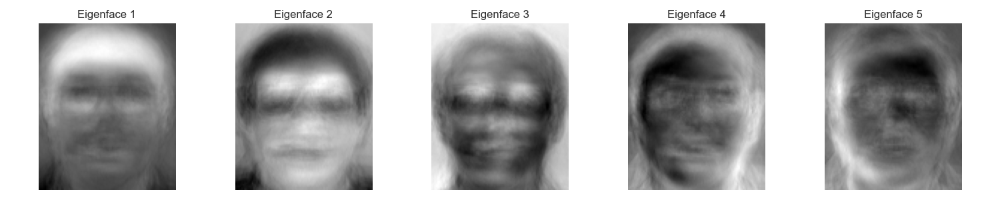
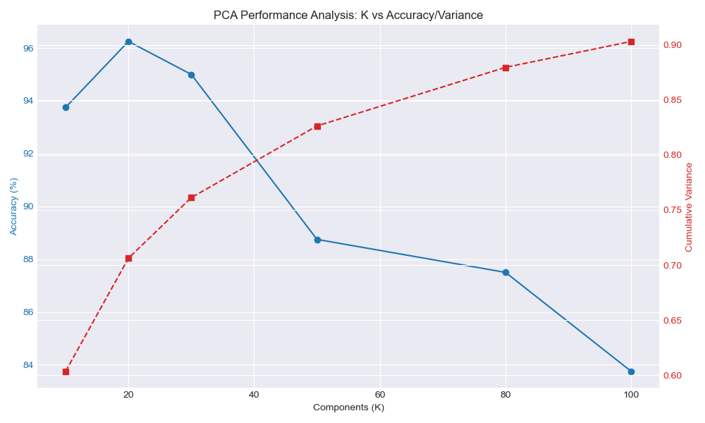
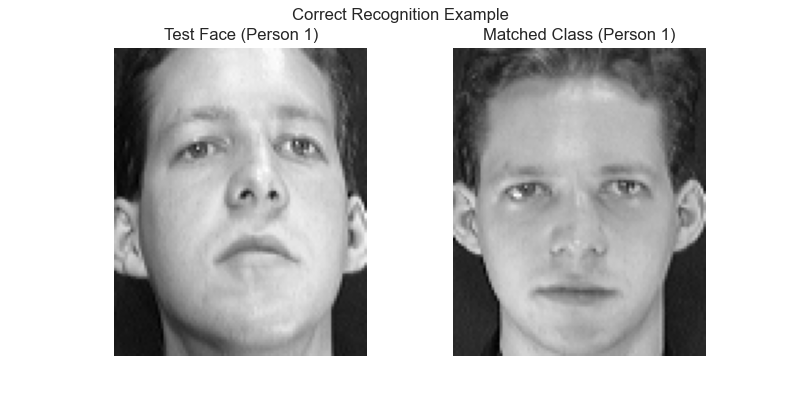
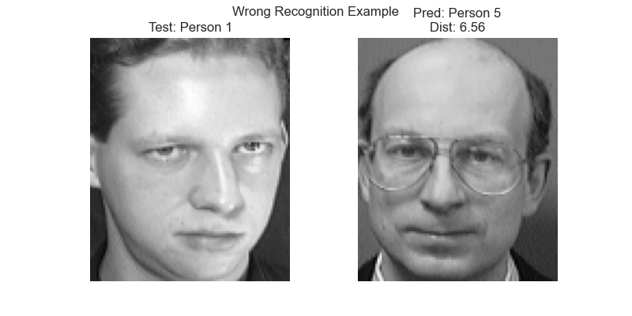

# 实验报告
## 实践：特征人脸识别和主成分分析（PCA）

**姓名**：[ReragoAliNa]  
**日期**：2025-12-15  
**地点**：e:\Codes_Py.SAS\SASProjects\Visual

---

### 一、实验目的
1. **理解流程**：掌握人脸识别的完整流程（预处理 -> 特征提取 -> 特征匹配），理解灰度化、归一化等预处理步骤的重要性。
2. **掌握PCA原理**：深入理解主成分分析（PCA）的数学基础，包括协方差矩阵、特征值分解及投影降维，明白如何提取“特征脸”。
3. **代码实现**：基于 Python 和 Sklearn 实现了完整的 PCA 人脸识别系统，包括数据加载、模型训练和识别测试。
4. **参数调优**：通过实验分析了主成分数量（K值）对识别准确率的影响，并确定了该数据集下的最优参数。

---

### 二、实验内容及原理
1. **核心流程**：
   - **预处理**：将 40 人的 ORL 数据集图像（112x92）展平为 10304 维向量，并进行中心化处理。
   - **降维**：使用 PCA 算法寻找数据方差最大的方向（主成分），将高维像素空间映射到低维特征空间。
   - **匹配**：使用欧氏距离（Euclidean Distance）计算测试集特征向量与训练集特征向量的相似度。

2. **PCA 数学原理**：
   - 设数据矩阵 $X$，计算其协方差矩阵 $C = \frac{1}{m}XX^T$。
   - 对 $C$ 进行特征分解，取前 $K$ 个最大特征值对应的特征向量构成投影矩阵 $W$。
   - 降维后的特征 $Y = XW$。

---

### 三、实验步骤
1. **环境搭建**：配置 Python 环境，安装 numpy, opencv-python, matplotlib, scikit-learn 等库。
2. **数据处理**：
   - 下载 AT&T ORL 数据集。
   - 遍历 40 个文件夹（s1-s40），每个文件夹 10 张图。
   - **划分数据集**：每人前 **8张** 作为训练集（共320张），后 **2张** 作为测试集（共80张）。
3. **特征提取**：
   - 使用 `sklearn.decomposition.PCA` 进行训练。
   - 开启白化（`whiten=True`）以标准化特征分量的方差。
4. **识别测试**：
   - 遍历 K 值 [10, 20, 30, 50, 80, 100] 进行实验。
   - 记录准确率及累计方差贡献率。
5. **可视化**：保存特征脸图像、准确率变化曲线及识别案例。

---

### 四、实验结果与分析

#### 1. PCA 特征提取结果
- **特征脸可视**：前5个主成分（Eigenfaces）展示了人脸数据集中最大的变化方向，通常对应整体光照、头部轮廓等低频信息。
  
- **方差贡献率**：
  - 当 K=10 时，累计贡献率约为 60%。
  - 当 K=100 时，累计贡献率超过 90%。

#### 2. 参数调优与准确率分析
实验对不同 K 值进行了测试，详细数据如下表：

| 主成分数量 (K) | 识别准确率 (Accuracy) | 累计方差贡献率 (Cumulative Variance) |
| :---: | :---: | :---: |
| 10 | 93.75% | 0.603 |
| **20** | **96.25%** | **0.706** |
| 30 | 95.00% | 0.761 |
| 50 | 88.75% | 0.826 |
| 80 | 87.50% | 0.880 |
| 100 | 83.75% | 0.903 |

- **趋势分析**：
  - 在 K=20 时，准确率达到最高 **96.25%**。
  - 奇怪的现象是，随着 K 值继续增加（>30），准确率反而下降。
  - **原因分析**：本实验开启了 **白化 (whiten=True)**。白化操作会将特征值较小（通常对应噪声）的主成分放大，使其方差归一化为1。当 K 值过大时，引入了过多包含微小噪声的高频分量，并在计算距离时被赋予了与主要特征相同的权重，从而干扰了识别，导致“过拟合”或噪声敏感。

  

#### 3. 识别案例
- **正确案例**：算法成功匹配了同一人的测试图与训练图。

  

- **错误案例**：错误识别通常发生在待测图像具有夸张表情、大幅度姿态偏转或极端光照变化时，导致其在像素空间的欧氏距离与非同类人脸更接近。

  

---

### 五、实验结论
1. **最优参数**：在本实验设置下，最优主成分数量为 **K=20**。此时既保留了足够的人脸区分信息（约70%方差），又避免了过多噪声干扰。
2. **算法有效性**：仅使用 20 维特征向量即可实现 96% 以上的识别准确率，证明了 PCA 在人脸特征降维方面的巨大优势（压缩比约为 10304:20 ≈ 500:1）。
3. **局限性**：实验发现算法对 K 值选择敏感，且在高维噪声引入后性能下降，说明基于像素欧氏距离的简单分类器鲁棒性有限。

---

### 六、思考题解答

1. **PCA 人脸识别的局限性有哪些？如何改进？**
   - **局限性**：PCA 是线性降维，对光照、姿态、表情变化非常敏感（这些非线性变化在像素空间中会产生巨大距离）。此外，它要求人脸严格对齐。
   - **改进**：
     - **光照**：在预处理阶段增加直方图均衡化或 Gamma 校正。
     - **特征**：使用 LBP（局部二值模式）或 Gabor 特征代替原始像素，增强纹理鲁棒性。
     - **模型**：使用非线性降维（如 KPCA）或深度学习方法（如 CNN, ArcFace）提取更鲁棒的语义特征。

2. **若将数据集替换为更大的人脸数据集（如 LFW），会遇到什么问题？如何优化？**
   - **问题**：
     - **计算量爆炸**：协方差矩阵尺寸或 SVD 分解的复杂度随数据量 $N$ 立方级增长，内存可能溢出。
     - **类内差异大**：LFW 包含自然场景下的多姿态人脸，简单的线性 PCA 无法有效聚类。
   - **优化**：
     - **增量 PCA (Incremental PCA)**：分批次加载数据进行训练，降低内存需求。
     - **随机 PCA (Randomized PCA)**：使用近似算法加速 SVD 分解。
     - **方法替换**：在大规模非受控场景下，通常放弃纯 PCA，改用深度卷积神经网络。

3. **除欧氏距离和余弦相似度外，还有哪些相似度度量方法？**
   - **曼哈顿距离 (L1)**：对异常值（outliers）比欧氏距离更不敏感。
   - **马氏距离 (Mahalanobis Distance)**：考虑特征各维度间的相关性和尺度，实际上相当于在 PCA/白化后的空间计算欧氏距离，非常适合人脸识别。

4. **对比 PCA 与线性判别分析（LDA）在人脸识别中的差异？**
   - **目标不同**：PCA 是**无监督**的，旨在最大化数据的**总体方差**（保留信息）；LDA 是**有监督**的，旨在最大化**类间距离**并最小化**类内距离**（增强区分度）。
   - **小样本表现**：在人脸识别中（通常训练样本少，维度高），LDA 容易过拟合（协方差矩阵奇异）。通常结合使用 **PCA+LDA**（先用 PCA 降维去除噪声和奇异性，再用 LDA 进行分类），这种方法也称为 Fisherfaces。
